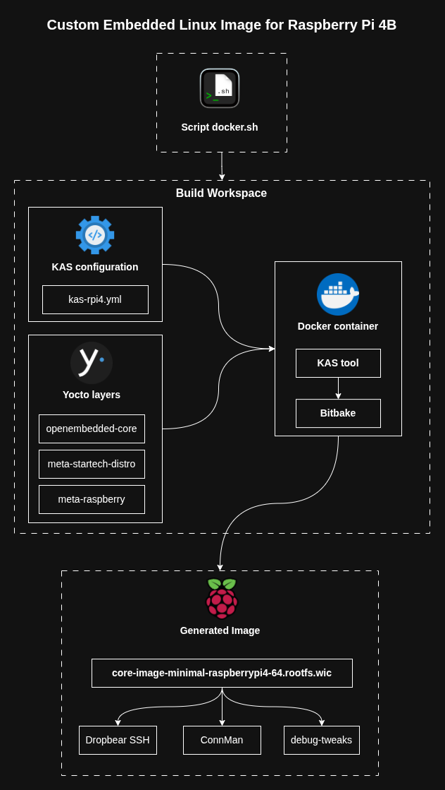
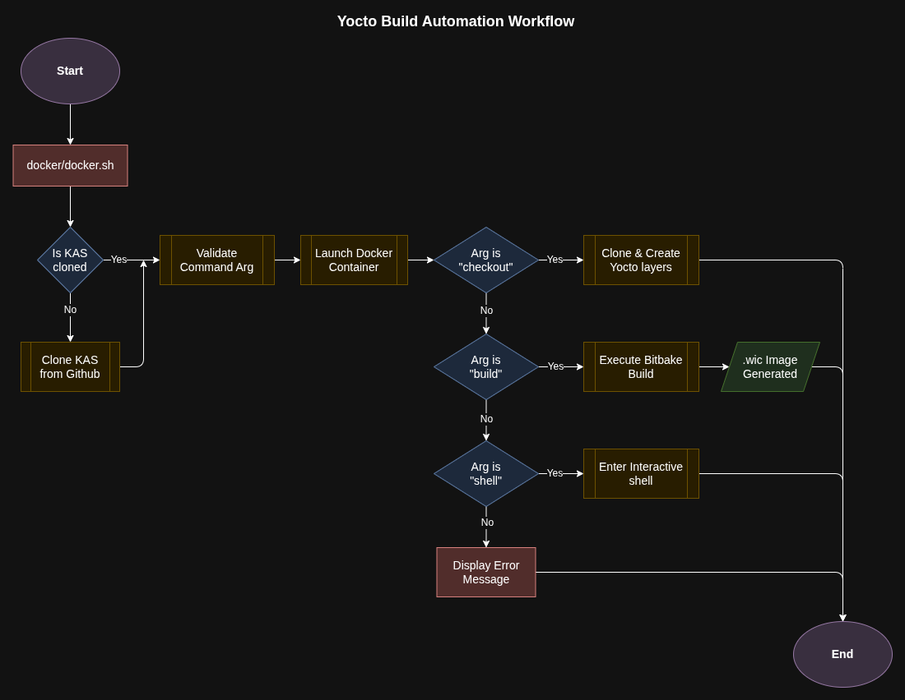
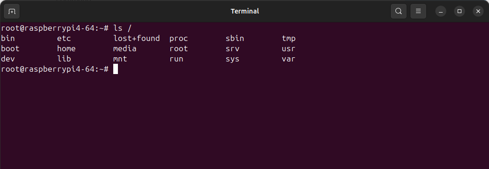

# Custom Embedded Linux Infrastructure for Raspberry Pi 4B


A custom Embedded Linux distribution built with **Yocto Project**, **KAS**, and **Docker**, targeting the **Raspberry Pi 4 Model B**.

The goal of this project is to provide a lightweight, reproducible, and maintainable Linux platform for embedded applications while avoiding the overhead of a general-purpose operating system.

The project introduces a custom distribution named **Startech**, built around a minimal image configuration and automated through a containerized build workflow. Using **KAS** and **Docker**, the entire build environment is isolated from the host machine, ensuring reproducible builds and simplified workspace management.

## Features

* Custom Yocto-based Linux distribution (`Startech`)
* Fully containerized build environment using Docker
* Automated workspace setup through KAS
* Lightweight SSH access using Dropbear
* Automatic Ethernet configuration using ConnMan
* Systemd-based service management
* Reproducible build workflow
* Deployment tested on Raspberry Pi 4 hardware

---

## Architecture Overview

The project is organized into three main layers:

### 1. Host Environment

The host machine runs Docker and executes the automation wrapper script responsible for launching the build environment.

### 2. Build Workspace

The workspace contains:

* KAS configuration files
* Yocto metadata layers
* Custom distribution layer (`meta-startech-distro`)

These components are mounted into the Docker container during the build process.

### 3. Generated Image

BitBake generates a deployable Linux image containing:

* Dropbear SSH
* ConnMan
* Systemd
* Debug Tweaks (development builds only)



---

## Build Workflow

The entire workflow is orchestrated through the `docker/docker.sh` automation script.

Supported commands:

```bash
./docker/docker.sh checkout
./docker/docker.sh build
./docker/docker.sh shell
```

Workflow summary:

1. Verify that the KAS repository exists locally.
2. Clone KAS automatically if missing.
3. Launch the Docker build environment.
4. Execute the requested command.
5. Generate the final image or open an interactive shell.



---

## Quick Start

### Prerequisites

* Linux host machine (Ubuntu/Debian recommended)
* Docker Engine installed and running

### Clone Repository

```bash
git clone https://github.com/mmekki96/yocto-raspberrypi-project.git
cd yocto-raspberrypi-project
```

### Download Yocto Layers

```bash
./docker/docker.sh checkout
```

Expected workspace structure:

```text
build/
kas/
layers/
```

### Build the Image

```bash
./docker/docker.sh build
```

### Open an Interactive Shell

```bash
./docker/docker.sh shell
```

---

## Deploying to Raspberry Pi 4

After a successful build, the generated image can be found under:

```bash
build/tmp/deploy/images/raspberrypi4-64/
```

Locate the latest image:

```bash
ls build/tmp/deploy/images/raspberrypi4-64/ | grep ".wic.bz2"
```

Example:

```text
core-image-minimal-raspberrypi4-64.rootfs.wic.bz2
```

### Flash the Image

> ⚠️ **Warning**
>
> Verify the target storage device carefully before running `dd`. Writing to the wrong block device may permanently destroy data from the host machine.

List currently connected storage devices:

```bash
ls /dev/sd*
```

Insert the SD card and run again:

```bash
ls /dev/sd*
```

Identify the newly detected device (for example `/dev/sdc`).

Flash the image:

```bash
bzcat build/tmp/deploy/images/raspberrypi4-64/core-image-minimal-raspberrypi4-64.rootfs.wic.bz2 | sudo dd of=/dev/sdX
```

Replace `/dev/sdX` with the correct SD card device.

---

### Hardware Validation

1. Insert the SD card into the Raspberry Pi 4.
2. Connect the board to the local network via Ethernet.
3. Power on the device.
4. Retrieve the assigned IP address from your router.
5. Connect through SSH:

```bash
ssh root@<RASPBERRY_PI_IP>
```

### Validation Screenshot



---

## Roadmap

### Phase 1 – Core Infrastructure ✅

* [x] Custom Startech distribution
* [x] KAS integration
* [x] Dockerized build environment
* [x] ConnMan networking
* [x] Dropbear SSH access

### Phase 2 – Sensor Integration

* [ ] Custom application layer
* [ ] DHT11/DHT22 integration
* [ ] Systemd service deployment

### Phase 3 – OTA Updates

* [ ] RAUC integration
* [ ] Secure A/B updates
* [ ] Remote deployment workflow

### Phase 4 – Platform Security

* [ ] Secure Boot
* [ ] Chain of Trust
* [ ] Signed image verification
